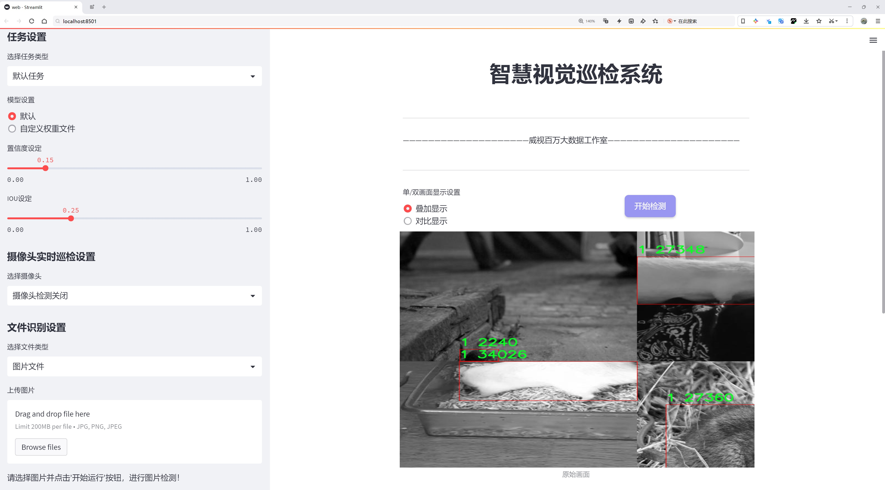

# 农作物害虫检测检测系统源码分享
 # [一条龙教学YOLOV8标注好的数据集一键训练_70+全套改进创新点发刊_Web前端展示]

### 1.研究背景与意义

项目参考[AAAI Association for the Advancement of Artificial Intelligence](https://gitee.com/qunmasj/projects)

项目来源[AACV Association for the Advancement of Computer Vision](https://kdocs.cn/l/cszuIiCKVNis)

研究背景与意义

随着全球人口的持续增长和农业需求的不断增加，如何有效地提高农作物的产量和质量，成为了农业科学研究的重要课题。农作物害虫的监测与防治是实现高效农业生产的关键环节之一。传统的人工检测方法不仅耗时耗力，而且容易受到主观因素的影响，导致漏检和误检现象的发生。因此，借助现代科技手段，尤其是计算机视觉和深度学习技术，来实现对农作物害虫的自动检测，已成为当前农业智能化发展的重要方向。

在这一背景下，YOLO（You Only Look Once）系列目标检测算法因其高效性和实时性，逐渐成为农业害虫检测领域的研究热点。YOLOv8作为该系列的最新版本，具备了更强的特征提取能力和更快的推理速度，能够在复杂的农业环境中快速、准确地识别和定位害虫。然而，尽管YOLOv8在目标检测方面表现出色，但在特定的农业应用场景中，仍然存在一定的局限性，例如对小目标的检测能力不足、背景干扰较大等问题。因此，基于YOLOv8的改进研究显得尤为重要。

本研究旨在基于改进的YOLOv8模型，构建一个高效的农作物害虫检测系统。我们将利用包含4100张图像的SMART AGRICULTURE数据集，该数据集涵盖了两类农作物害虫，能够为模型的训练和测试提供丰富的样本。通过对数据集的深入分析，我们将针对不同类别的害虫特征，设计相应的改进策略，以提升模型在实际应用中的表现。具体而言，我们将通过数据增强、特征融合、模型剪枝等技术手段，优化YOLOv8的网络结构和训练流程，以提高其对小目标和复杂背景的适应能力。

此外，本研究的意义不仅在于提升农作物害虫的检测精度，更在于推动智能农业的发展。通过构建高效的害虫检测系统，农民可以实时监测作物健康状况，及时采取防治措施，从而减少农药的使用，提高农业生产的可持续性。同时，该系统的推广应用将为农业管理提供科学依据，助力农业生产向数字化、智能化转型。

综上所述，基于改进YOLOv8的农作物害虫检测系统的研究，不仅具有重要的理论价值，还有着广泛的实际应用前景。通过深入探讨和解决当前农作物害虫检测中的关键问题，本研究将为推动农业智能化发展贡献一份力量，助力实现更高效、更环保的农业生产模式。

### 2.图片演示





##### 注意：由于此博客编辑较早，上面“2.图片演示”和“3.视频演示”展示的系统图片或者视频可能为老版本，新版本在老版本的基础上升级如下：（实际效果以升级的新版本为准）

  （1）适配了YOLOV8的“目标检测”模型和“实例分割”模型，通过加载相应的权重（.pt）文件即可自适应加载模型。

  （2）支持“图片识别”、“视频识别”、“摄像头实时识别”三种识别模式。

  （3）支持“图片识别”、“视频识别”、“摄像头实时识别”三种识别结果保存导出，解决手动导出（容易卡顿出现爆内存）存在的问题，识别完自动保存结果并导出到tempDir中。

  （4）支持Web前端系统中的标题、背景图等自定义修改，后面提供修改教程。

  另外本项目提供训练的数据集和训练教程,暂不提供权重文件（best.pt）,需要您按照教程进行训练后实现图片演示和Web前端界面演示的效果。

### 3.视频演示

[3.1 视频演示](https://www.bilibili.com/video/BV1zfszeAEnW/)

### 4.数据集信息展示

##### 4.1 本项目数据集详细数据（类别数＆类别名）

nc: 2
names: ['0', '1']


##### 4.2 本项目数据集信息介绍

数据集信息展示

在现代农业中，害虫的监测与管理是确保作物健康和提高产量的关键环节。为了提升农作物害虫检测的效率与准确性，我们构建了一个名为“SMART AGRICULTURE”的数据集，旨在为改进YOLOv8模型提供高质量的训练数据。该数据集专注于两类主要的农作物害虫，分别用数字“0”和“1”进行标识。这种简洁的分类方式不仅有助于模型的快速学习，也为后续的分析与应用提供了便利。

“SMART AGRICULTURE”数据集的构建过程经过精心设计，确保了数据的多样性和代表性。我们从多个农业生产区域收集了大量的图像数据，这些图像涵盖了不同生长阶段的作物以及多种环境条件下的害虫活动。通过这种方式，数据集不仅反映了实际农业生产中的复杂性，也为模型的泛化能力提供了良好的基础。

在数据集的标注过程中，我们采用了专业的标注工具，确保每一张图像中的害虫都被准确地识别和标记。每个类别的样本数量经过严格控制，以避免类别不平衡对模型训练造成的负面影响。通过这种方式，我们力求让YOLOv8模型在学习过程中，能够充分理解每一类害虫的特征与行为模式，从而在实际应用中实现高效的检测。

此外，为了增强数据集的实用性，我们还进行了数据增强处理。这包括图像的旋转、缩放、翻转及亮度调整等多种技术手段，旨在模拟不同的拍摄条件和环境变化。通过这些增强技术，我们能够有效扩展数据集的规模，提高模型的鲁棒性和适应性。这一过程不仅提升了模型在面对不同场景时的表现，也为实际农业应用提供了更为可靠的技术支持。

“SMART AGRICULTURE”数据集的最终目标是通过训练出更为精准的YOLOv8模型，帮助农民及时发现和识别作物中的害虫，从而采取相应的防治措施。随着数据集的不断完善与更新，我们期待能够在未来的研究中，进一步提高模型的检测精度和速度，为农业生产的智能化发展贡献力量。

总之，“SMART AGRICULTURE”数据集的构建不仅是对农作物害虫检测技术的一次重要尝试，更是推动农业智能化进程的重要一步。通过高质量的数据集与先进的深度学习模型结合，我们有信心在不久的将来，实现对农作物害虫的高效监测与管理，为可持续农业发展提供强有力的支持。


### 5.全套项目环境部署视频教程（零基础手把手教学）

[5.1 环境部署教程链接（零基础手把手教学）](https://www.ixigua.com/7404473917358506534?logTag=c807d0cbc21c0ef59de5)


[5.2 安装Python虚拟环境创建和依赖库安装视频教程链接（零基础手把手教学）](https://www.ixigua.com/7404474678003106304?logTag=1f1041108cd1f708b01a)

### 6.手把手YOLOV8训练视频教程（零基础小白有手就能学会）

[6.1 手把手YOLOV8训练视频教程（零基础小白有手就能学会）](https://www.ixigua.com/7404477157818401292?logTag=d31a2dfd1983c9668658)

### 7.70+种全套YOLOV8创新点代码加载调参视频教程（一键加载写好的改进模型的配置文件）

[7.1 70+种全套YOLOV8创新点代码加载调参视频教程（一键加载写好的改进模型的配置文件）](https://www.ixigua.com/7404478314661806627?logTag=29066f8288e3f4eea3a4)

### 8.70+种全套YOLOV8创新点原理讲解（非科班也可以轻松写刊发刊，V10版本正在科研待更新）

由于篇幅限制，每个创新点的具体原理讲解就不一一展开，具体见下列网址中的创新点对应子项目的技术原理博客网址【Blog】：


[8.1 70+种全套YOLOV8创新点原理讲解链接](https://gitee.com/qunmasj/good)

### 9.系统功能展示（检测对象为举例，实际内容以本项目数据集为准）

图9.1.系统支持检测结果表格显示

  图9.2.系统支持置信度和IOU阈值手动调节

  图9.3.系统支持自定义加载权重文件best.pt(需要你通过步骤5中训练获得)

  图9.4.系统支持摄像头实时识别

  图9.5.系统支持图片识别

  图9.6.系统支持视频识别

  图9.7.系统支持识别结果文件自动保存

  图9.8.系统支持Excel导出检测结果数据


### 10.原始YOLOV8算法原理

原始YOLOv8算法原理

YOLOv8算法是目标检测领域的一个重要里程碑，它在YOLO系列算法的基础上进行了多项创新和优化，旨在实现更高的检测精度和更快的处理速度。该算法的核心思想是通过深度学习模型直接从输入图像中提取特征，并进行目标检测和定位，而无需依赖传统的滑动窗口或区域提议方法。这种方法不仅提高了检测的效率，还显著提升了模型的准确性，使其在各种应用场景中表现出色，如智能监控、自动驾驶和人脸识别等。

在YOLOv8的架构中，主干网络采用了跨级结构（Cross Stage Partial, CSP）的设计理念，进一步优化了YOLOv5中的C3模块，替换为更轻量的C2F模块。这一改进使得网络在保持较高的特征提取能力的同时，显著降低了计算复杂度。C2F模块通过并行化多个梯度流分支，增强了信息流动的丰富性，从而提升了模型的性能。此外，YOLOv8保留了空间金字塔池化模块，利用多尺度特征来增强模型对不同尺寸目标的检测能力。

YOLOv8在特征提取的过程中，依然遵循特征金字塔的思想，但在上采样阶段进行了重要的简化，去除了多余的卷积结构。这一设计不仅减少了计算量，还提高了特征图的传递效率，使得网络能够更快地响应输入数据的变化。通过这样的结构调整，YOLOv8能够在多种场景下实现实时目标检测，满足实际应用对速度和精度的双重需求。

在损失函数的设计上，YOLOv8引入了新的损失策略，以提高目标检测的准确性。具体而言，算法采用了变焦损失来计算分类损失，并结合数据平均保真度损失和完美交并比损失来评估边界框的损失。这种新颖的损失计算方式使得模型在训练过程中能够更有效地聚焦于难以检测的目标，从而提升了整体的检测性能。

为了进一步增强YOLOv8的灵活性和适应性，算法在样本匹配方式上进行了创新，采用了无锚框（Anchor-Free）的方法。这一方法不再依赖于预设的锚框，而是将目标检测转化为关键点检测，简化了模型的设计并提高了其泛化能力。通过消除锚框的使用，YOLOv8能够在不同的数据集和场景中更好地适应目标物体的多样性，避免了传统锚框方法在处理差异较大物体时的局限性。

在输入处理方面，YOLOv8默认的输入图像尺寸为640x640，但为了适应不同长宽比的图像，算法在推理阶段采用了自适应图像缩放技术。这一技术通过将长边按比例缩小到指定尺寸，并对短边进行填充，最大限度地减少了信息冗余，提升了目标检测的速度和精度。此外，YOLOv8在训练过程中引入了Mosaic图像增强操作，通过随机拼接多张图像，迫使模型学习到更多的上下文信息，从而提高了预测的准确性。

YOLOv8的网络结构分为多个模块，包括输入层、主干网络（Backbone）、颈部（Neck）和头部（Head）。在主干网络中，C2F模块的引入使得特征提取更加高效，而在颈部，YOLOv8通过简化上采样过程，直接对不同阶段输出的特征进行处理，进一步提升了模型的性能。在头部，YOLOv8采用了解耦头（Decoupled-Head）结构，将检测和分类任务分开处理，分别通过不同的卷积模块进行特征提取和预测，这种设计不仅提高了模型的灵活性，还增强了对复杂场景的适应能力。

总的来说，YOLOv8算法通过一系列的创新和优化，显著提升了目标检测的精度和速度。其无锚框的设计、灵活的输入处理方式以及高效的特征提取模块，使得YOLOv8在面对复杂的目标检测任务时，能够表现出色。随着YOLOv8的不断发展和应用，未来的目标检测领域将迎来更多的可能性和挑战。


### 11.项目核心源码讲解（再也不用担心看不懂代码逻辑）

#### 11.1 ui.py

以下是经过精简和注释的核心代码：

```python
import sys
import subprocess

def run_script(script_path):
    """
    使用当前 Python 环境运行指定的脚本。

    Args:
        script_path (str): 要运行的脚本路径
    """
    # 获取当前 Python 解释器的路径
    python_path = sys.executable

    # 构建运行命令，使用 streamlit 运行指定的脚本
    command = f'"{python_path}" -m streamlit run "{script_path}"'

    # 执行命令，并捕获结果
    result = subprocess.run(command, shell=True)
    
    # 检查命令执行是否成功
    if result.returncode != 0:
        print("脚本运行出错。")

# 主程序入口
if __name__ == "__main__":
    # 指定要运行的脚本路径
    script_path = "web.py"  # 这里可以直接指定脚本名称

    # 调用函数运行脚本
    run_script(script_path)
```

### 代码注释说明：
1. **导入模块**：
   - `sys`：用于获取当前 Python 解释器的路径。
   - `subprocess`：用于执行外部命令。

2. **`run_script` 函数**：
   - 该函数接收一个脚本路径作为参数，并使用当前 Python 环境运行该脚本。
   - 使用 `sys.executable` 获取当前 Python 解释器的路径，以确保使用正确的 Python 环境。
   - 构建命令字符串，使用 `streamlit` 运行指定的脚本。
   - 使用 `subprocess.run` 执行命令，并检查返回码以确定脚本是否成功运行。

3. **主程序入口**：
   - 在 `if __name__ == "__main__":` 块中，指定要运行的脚本路径（这里直接指定为 `"web.py"`）。
   - 调用 `run_script` 函数执行指定的脚本。

这个文件是一个名为 `ui.py` 的 Python 脚本，主要功能是运行一个名为 `web.py` 的 Streamlit 应用。首先，文件中导入了一些必要的模块，包括 `sys`、`os` 和 `subprocess`，这些模块分别用于系统操作、文件路径处理和执行外部命令。

在文件的开头，定义了一个名为 `run_script` 的函数，该函数接受一个参数 `script_path`，用于指定要运行的脚本的路径。函数内部首先获取当前 Python 解释器的路径，使用 `sys.executable` 来实现。接着，构建一个命令字符串，该命令使用当前的 Python 解释器和 Streamlit 模块来运行指定的脚本。命令的格式是 `"{python_path}" -m streamlit run "{script_path}"`，其中 `python_path` 是当前 Python 解释器的路径，`script_path` 是传入的脚本路径。

然后，使用 `subprocess.run` 方法来执行构建好的命令。该方法的 `shell=True` 参数允许在 shell 中执行命令。执行完命令后，检查返回码 `result.returncode`，如果返回码不为 0，表示脚本运行过程中出现了错误，此时会打印出 "脚本运行出错。" 的提示信息。

在文件的最后部分，使用 `if __name__ == "__main__":` 来判断是否是直接运行该脚本。如果是，则指定要运行的脚本路径为 `web.py`，这个路径是通过调用 `abs_path` 函数获取的，确保得到的是一个绝对路径。最后，调用 `run_script` 函数来执行 `web.py` 脚本。

总体来说，这个脚本的作用是为 Streamlit 应用提供一个启动入口，通过调用 `web.py` 脚本来启动一个 Web 应用。

#### 11.2 70+种YOLOv8算法改进源码大全和调试加载训练教程（非必要）\ultralytics\utils\ops.py

以下是代码中最核心的部分，并附上详细的中文注释：

```python
import torch
import torchvision

def non_max_suppression(
        prediction,
        conf_thres=0.25,
        iou_thres=0.45,
        classes=None,
        agnostic=False,
        multi_label=False,
        labels=(),
        max_det=300,
        nc=0,  # 类别数量（可选）
        max_time_img=0.05,
        max_nms=30000,
        max_wh=7680,
):
    """
    对一组边界框执行非极大值抑制（NMS），支持掩码和每个框多个标签。

    参数:
        prediction (torch.Tensor): 形状为 (batch_size, num_classes + 4 + num_masks, num_boxes) 的张量，
            包含预测的框、类别和掩码。张量格式应与模型输出一致，例如 YOLO。
        conf_thres (float): 置信度阈值，低于该值的框将被过滤掉。有效值在 0.0 和 1.0 之间。
        iou_thres (float): IoU 阈值，低于该值的框在 NMS 过程中将被过滤掉。有效值在 0.0 和 1.0 之间。
        classes (List[int]): 要考虑的类别索引列表。如果为 None，则考虑所有类别。
        agnostic (bool): 如果为 True，模型对类别数量不敏感，所有类别将被视为一个类别。
        multi_label (bool): 如果为 True，每个框可能有多个标签。
        labels (List[List[Union[int, float, torch.Tensor]]]): 每个图像的先验标签列表。
        max_det (int): NMS 后要保留的最大框数量。
        nc (int, optional): 模型输出的类别数量。任何超出此数量的索引将被视为掩码。
        max_time_img (float): 处理一张图像的最大时间（秒）。
        max_nms (int): 传递给 torchvision.ops.nms() 的最大框数量。
        max_wh (int): 最大框宽度和高度（像素）。

    返回:
        (List[torch.Tensor]): 长度为 batch_size 的列表，每个元素是形状为 (num_boxes, 6 + num_masks) 的张量，
            包含保留的框，列为 (x1, y1, x2, y2, confidence, class, mask1, mask2, ...)。
    """

    # 检查置信度和IoU阈值的有效性
    assert 0 <= conf_thres <= 1, f'无效的置信度阈值 {conf_thres}, 有效值在 0.0 和 1.0 之间'
    assert 0 <= iou_thres <= 1, f'无效的IoU {iou_thres}, 有效值在 0.0 和 1.0 之间'
    
    # 如果预测是列表或元组，选择推理输出
    if isinstance(prediction, (list, tuple)):
        prediction = prediction[0]  # 选择推理输出

    device = prediction.device  # 获取设备信息
    bs = prediction.shape[0]  # 批量大小
    nc = nc or (prediction.shape[1] - 4)  # 类别数量
    nm = prediction.shape[1] - nc - 4  # 掩码数量
    mi = 4 + nc  # 掩码起始索引
    xc = prediction[:, 4:mi].amax(1) > conf_thres  # 置信度候选框

    # 设置时间限制
    time_limit = 0.5 + max_time_img * bs  # 超过此时间将停止处理

    # 转置预测张量
    prediction = prediction.transpose(-1, -2)  # 形状调整

    output = [torch.zeros((0, 6 + nm), device=prediction.device)] * bs  # 初始化输出
    for xi, x in enumerate(prediction):  # 遍历每张图像的预测
        x = x[xc[xi]]  # 仅保留置信度高的框

        # 如果没有框，继续处理下一张图像
        if not x.shape[0]:
            continue

        # 分离边界框、类别和掩码
        box, cls, mask = x.split((4, nc, nm), 1)

        # 处理多标签情况
        if multi_label:
            i, j = torch.where(cls > conf_thres)
            x = torch.cat((box[i], x[i, 4 + j, None], j[:, None].float(), mask[i]), 1)
        else:  # 仅保留最佳类别
            conf, j = cls.max(1, keepdim=True)
            x = torch.cat((box, conf, j.float(), mask), 1)[conf.view(-1) > conf_thres]

        # 过滤类别
        if classes is not None:
            x = x[(x[:, 5:6] == torch.tensor(classes, device=x.device)).any(1)]

        n = x.shape[0]  # 当前框的数量
        if not n:  # 如果没有框，继续
            continue
        if n > max_nms:  # 如果框的数量超过最大限制，按置信度排序并保留前 max_nms 个框
            x = x[x[:, 4].argsort(descending=True)[:max_nms]]

        # 执行批量 NMS
        boxes, scores = x[:, :4], x[:, 4]  # 提取框和置信度
        i = torchvision.ops.nms(boxes, scores, iou_thres)  # NMS
        i = i[:max_det]  # 限制检测数量

        output[xi] = x[i]  # 保存当前图像的输出
        if (time.time() - t) > time_limit:  # 检查时间限制
            break  # 超过时间限制，停止处理

    return output  # 返回处理后的结果
```

### 代码说明
1. **导入库**：引入了 PyTorch 和 torchvision 库，主要用于深度学习和计算机视觉任务。
2. **非极大值抑制（NMS）**：这是目标检测中常用的技术，用于去除冗余的重叠框，只保留置信度最高的框。
3. **参数设置**：函数接收多个参数，包括置信度阈值、IoU 阈值、类别过滤等，确保灵活性和适应性。
4. **框的处理**：根据置信度和类别进行过滤，并执行 NMS 操作，最终返回每张图像的检测结果。

该函数是目标检测模型后处理的重要部分，确保输出的框是准确且不重复的。

这个程序文件是一个与YOLOv8算法相关的工具类，主要用于处理图像中的目标检测任务。文件中包含多个函数和一个类，具体功能如下：

首先，文件定义了一个名为`Profile`的类，用于性能分析。这个类可以作为装饰器或上下文管理器使用，能够记录代码块的执行时间。它在初始化时会检查CUDA是否可用，并在`__enter__`和`__exit__`方法中分别开始和结束计时，最终返回经过累积的时间。

接下来，文件中定义了一些函数，用于处理图像中的目标检测框和分割掩码。`segment2box`函数将分割标签转换为边界框标签，并确保框的坐标在图像内部。`scale_boxes`函数则用于根据不同图像的尺寸调整边界框的大小。

`make_divisible`函数返回一个最接近的可被指定除数整除的数字。`non_max_suppression`函数实现了非极大值抑制（NMS），用于过滤重叠的检测框，保留最有可能的检测结果。该函数支持多标签和掩码，并提供了一些参数来控制检测的精度和数量。

文件中还包含了一些用于坐标转换的函数，如`xyxy2xywh`和`xywh2xyxy`，这些函数用于在不同的边界框表示法之间进行转换。此外，还有一些函数用于裁剪和缩放掩码、坐标以及处理分割结果。

例如，`masks2segments`函数将掩码转换为分割线段，支持选择最大的分割或连接所有分割。`convert_torch2numpy_batch`函数将PyTorch张量批量转换为NumPy数组，方便后续处理。

最后，`clean_str`函数用于清理字符串，替换特殊字符为下划线，确保字符串的有效性。

总体而言，这个文件提供了一系列工具函数，旨在支持YOLOv8模型在目标检测和分割任务中的应用，方便用户进行数据处理和结果分析。

#### 11.3 code\chinese_name_list.py

以下是代码中最核心的部分，并附上详细的中文注释：

```python
# -*- coding: utf-8 -*-  # 指定文件编码为UTF-8，以支持中文字符

# 创建一个字典，包含中文名称的映射
Chinese_name = {'person': "人"}

# 从字典中提取所有的值，并将其转换为列表
Label_list = list(Chinese_name.values())

# 现在 Label_list 变量中包含了字典中所有的中文名称
```

### 代码解析：
1. `# -*- coding: utf-8 -*-`：这行代码用于指定文件的编码格式为UTF-8，确保能够正确处理中文字符。
2. `Chinese_name = {'person': "人"}`：创建一个字典 `Chinese_name`，其中键为 `'person'`，值为中文字符 `"人"`。
3. `Label_list = list(Chinese_name.values())`：使用 `values()` 方法从字典中提取所有的值（即中文名称），并将其转换为列表，赋值给变量 `Label_list`。此时，`Label_list` 中将包含 `["人"]`。

这个程序文件的名称是 `chinese_name_list.py`，它的主要功能是定义一个包含中文名称的字典，并从中提取出值形成一个列表。

首先，文件开头的 `# -*- coding: utf-8 -*-` 是一个编码声明，表明该文件使用 UTF-8 编码格式。这对于处理中文字符非常重要，因为它确保了程序能够正确识别和处理中文内容。

接下来，程序定义了一个字典 `Chinese_name`，其中包含一个键值对。键是字符串 `"person"`，对应的值是中文字符 `"人"`。这个字典的目的是将某些英文单词映射到其中文翻译。

然后，程序通过 `list(Chinese_name.values())` 语句创建了一个列表 `Label_list`，这个列表包含了字典 `Chinese_name` 中所有的值。在这个例子中，`Label_list` 将只包含一个元素，即中文字符 `"人"`。

总结来说，这段代码的功能是将一个简单的中文名称映射存储在字典中，并将其值提取到一个列表中，以便后续使用。

#### 11.4 70+种YOLOv8算法改进源码大全和调试加载训练教程（非必要）\ultralytics\utils\tal.py

以下是代码中最核心的部分，并附上详细的中文注释：

```python
import torch
import torch.nn as nn

def select_candidates_in_gts(xy_centers, gt_bboxes, eps=1e-9):
    """
    从真实框中选择正样本的锚点中心。

    参数:
        xy_centers (Tensor): 形状为(h*w, 2)的张量，表示锚点的中心坐标。
        gt_bboxes (Tensor): 形状为(b, n_boxes, 4)的张量，表示真实框的坐标。

    返回:
        (Tensor): 形状为(b, n_boxes, h*w)的张量，表示每个真实框内的锚点中心。
    """
    n_anchors = xy_centers.shape[0]  # 锚点数量
    bs, n_boxes, _ = gt_bboxes.shape  # 批量大小和真实框数量
    lt, rb = gt_bboxes.view(-1, 1, 4).chunk(2, 2)  # 分离出左上角和右下角坐标
    bbox_deltas = torch.cat((xy_centers[None] - lt, rb - xy_centers[None]), dim=2).view(bs, n_boxes, n_anchors, -1)
    return bbox_deltas.amin(3).gt_(eps)  # 返回每个锚点与真实框的最小距离是否大于eps

class TaskAlignedAssigner(nn.Module):
    """
    用于目标检测的任务对齐分配器。

    属性:
        topk (int): 考虑的前k个候选框数量。
        num_classes (int): 目标类别数量。
        alpha (float): 任务对齐度量的分类部分的alpha参数。
        beta (float): 任务对齐度量的定位部分的beta参数。
        eps (float): 防止除以零的小值。
    """

    def __init__(self, topk=13, num_classes=80, alpha=1.0, beta=6.0, eps=1e-9):
        """初始化任务对齐分配器对象，设置可调超参数。"""
        super().__init__()
        self.topk = topk
        self.num_classes = num_classes
        self.bg_idx = num_classes  # 背景类别索引
        self.alpha = alpha
        self.beta = beta
        self.eps = eps

    @torch.no_grad()
    def forward(self, pd_scores, pd_bboxes, anc_points, gt_labels, gt_bboxes, mask_gt):
        """
        计算任务对齐分配。

        参数:
            pd_scores (Tensor): 形状为(bs, num_total_anchors, num_classes)的张量，表示锚点的预测分数。
            pd_bboxes (Tensor): 形状为(bs, num_total_anchors, 4)的张量，表示锚点的预测边界框。
            anc_points (Tensor): 形状为(num_total_anchors, 2)的张量，表示锚点的坐标。
            gt_labels (Tensor): 形状为(bs, n_max_boxes, 1)的张量，表示真实框的标签。
            gt_bboxes (Tensor): 形状为(bs, n_max_boxes, 4)的张量，表示真实框的坐标。
            mask_gt (Tensor): 形状为(bs, n_max_boxes, 1)的张量，表示真实框的掩码。

        返回:
            target_labels (Tensor): 形状为(bs, num_total_anchors)的张量，表示目标标签。
            target_bboxes (Tensor): 形状为(bs, num_total_anchors, 4)的张量，表示目标边界框。
            target_scores (Tensor): 形状为(bs, num_total_anchors, num_classes)的张量，表示目标分数。
            fg_mask (Tensor): 形状为(bs, num_total_anchors)的张量，表示前景掩码。
            target_gt_idx (Tensor): 形状为(bs, num_total_anchors)的张量，表示目标真实框索引。
        """
        self.bs = pd_scores.size(0)  # 批量大小
        self.n_max_boxes = gt_bboxes.size(1)  # 最大真实框数量

        if self.n_max_boxes == 0:  # 如果没有真实框
            device = gt_bboxes.device
            return (torch.full_like(pd_scores[..., 0], self.bg_idx).to(device), 
                    torch.zeros_like(pd_bboxes).to(device),
                    torch.zeros_like(pd_scores).to(device), 
                    torch.zeros_like(pd_scores[..., 0]).to(device),
                    torch.zeros_like(pd_scores[..., 0]).to(device))

        # 获取正样本掩码和对齐度量
        mask_pos, align_metric, overlaps = self.get_pos_mask(pd_scores, pd_bboxes, gt_labels, gt_bboxes, anc_points, mask_gt)

        # 选择具有最高重叠的真实框
        target_gt_idx, fg_mask, mask_pos = select_highest_overlaps(mask_pos, overlaps, self.n_max_boxes)

        # 获取目标标签、边界框和分数
        target_labels, target_bboxes, target_scores = self.get_targets(gt_labels, gt_bboxes, target_gt_idx, fg_mask)

        # 归一化对齐度量
        align_metric *= mask_pos
        pos_align_metrics = align_metric.amax(dim=-1, keepdim=True)  # 获取每个正样本的最大对齐度量
        pos_overlaps = (overlaps * mask_pos).amax(dim=-1, keepdim=True)  # 获取每个正样本的最大重叠度
        norm_align_metric = (align_metric * pos_overlaps / (pos_align_metrics + self.eps)).amax(-2).unsqueeze(-1)
        target_scores = target_scores * norm_align_metric  # 更新目标分数

        return target_labels, target_bboxes, target_scores, fg_mask.bool(), target_gt_idx

    def get_pos_mask(self, pd_scores, pd_bboxes, gt_labels, gt_bboxes, anc_points, mask_gt):
        """获取在真实框内的掩码，形状为(b, max_num_obj, h*w)。"""
        mask_in_gts = select_candidates_in_gts(anc_points, gt_bboxes)  # 获取在真实框内的锚点掩码
        align_metric, overlaps = self.get_box_metrics(pd_scores, pd_bboxes, gt_labels, gt_bboxes, mask_in_gts * mask_gt)  # 计算对齐度量和重叠度
        mask_topk = self.select_topk_candidates(align_metric, topk_mask=mask_gt.expand(-1, -1, self.topk).bool())  # 选择前k个候选
        mask_pos = mask_topk * mask_in_gts * mask_gt  # 合并所有掩码

        return mask_pos, align_metric, overlaps

    def get_box_metrics(self, pd_scores, pd_bboxes, gt_labels, gt_bboxes, mask_gt):
        """计算给定预测框和真实框的对齐度量。"""
        na = pd_bboxes.shape[-2]  # 锚点数量
        mask_gt = mask_gt.bool()  # 转换为布尔类型
        overlaps = torch.zeros([self.bs, self.n_max_boxes, na], dtype=pd_bboxes.dtype, device=pd_bboxes.device)  # 初始化重叠度张量
        bbox_scores = torch.zeros([self.bs, self.n_max_boxes, na], dtype=pd_scores.dtype, device=pd_scores.device)  # 初始化边界框分数张量

        ind = torch.zeros([2, self.bs, self.n_max_boxes], dtype=torch.long)  # 创建索引张量
        ind[0] = torch.arange(end=self.bs).view(-1, 1).expand(-1, self.n_max_boxes)  # 批量索引
        ind[1] = gt_labels.squeeze(-1)  # 真实框标签索引
        bbox_scores[mask_gt] = pd_scores[ind[0], :, ind[1]][mask_gt]  # 获取每个锚点的分数

        # 计算重叠度
        pd_boxes = pd_bboxes.unsqueeze(1).expand(-1, self.n_max_boxes, -1, -1)[mask_gt]  # 扩展预测框
        gt_boxes = gt_bboxes.unsqueeze(2).expand(-1, -1, na, -1)[mask_gt]  # 扩展真实框
        overlaps[mask_gt] = bbox_iou(gt_boxes, pd_boxes, xywh=False, CIoU=True).squeeze(-1).clamp_(0)  # 计算IoU

        align_metric = bbox_scores.pow(self.alpha) * overlaps.pow(self.beta)  # 计算对齐度量
        return align_metric, overlaps

    def select_topk_candidates(self, metrics, largest=True, topk_mask=None):
        """
        根据给定的度量选择前k个候选。

        参数:
            metrics (Tensor): 形状为(b, max_num_obj, h*w)的张量，表示度量值。
            largest (bool): 如果为True，选择最大的值；否则，选择最小的值。
            topk_mask (Tensor): 可选的布尔张量，形状为(b, max_num_obj, topk)。

        返回:
            (Tensor): 形状为(b, max_num_obj, h*w)的张量，包含选择的前k个候选。
        """
        topk_metrics, topk_idxs = torch.topk(metrics, self.topk, dim=-1, largest=largest)  # 获取前k个度量值和索引
        if topk_mask is None:
            topk_mask = (topk_metrics.max(-1, keepdim=True)[0] > self.eps).expand_as(topk_idxs)  # 创建掩码
        topk_idxs.masked_fill_(~topk_mask, 0)  # 用0填充无效索引

        count_tensor = torch.zeros(metrics.shape, dtype=torch.int8, device=topk_idxs.device)  # 初始化计数张量
        ones = torch.ones_like(topk_idxs[:, :, :1], dtype=torch.int8, device=topk_idxs.device)  # 创建全1张量
        for k in range(self.topk):
            count_tensor.scatter_add_(-1, topk_idxs[:, :, k:k + 1], ones)  # 统计每个候选的出现次数
        count_tensor.masked_fill_(count_tensor > 1, 0)  # 过滤无效边界框

        return count_tensor.to(metrics.dtype)  # 返回计数张量

    def get_targets(self, gt_labels, gt_bboxes, target_gt_idx, fg_mask):
        """
        计算正样本锚点的目标标签、目标边界框和目标分数。

        参数:
            gt_labels (Tensor): 真实框标签，形状为(b, max_num_obj, 1)。
            gt_bboxes (Tensor): 真实框边界框，形状为(b, max_num_obj, 4)。
            target_gt_idx (Tensor): 正样本锚点的真实框索引，形状为(b, h*w)。
            fg_mask (Tensor): 形状为(b, h*w)的布尔张量，表示前景锚点。

        返回:
            (Tuple[Tensor, Tensor, Tensor]): 包含目标标签、目标边界框和目标分数的元组。
        """
        batch_ind = torch.arange(end=self.bs, dtype=torch.int64, device=gt_labels.device)[..., None]  # 批量索引
        target_gt_idx = target_gt_idx + batch_ind * self.n_max_boxes  # 更新真实框索引
        target_labels = gt_labels.long().flatten()[target_gt_idx]  # 获取目标标签

        target_bboxes = gt_bboxes.view(-1, 4)[target_gt_idx]  # 获取目标边界框

        target_labels.clamp_(0)  # 限制标签值

        target_scores = torch.zeros((target_labels.shape[0], target_labels.shape[1], self.num_classes),
                                    dtype=torch.int64,
                                    device=target_labels.device)  # 初始化目标分数张量
        target_scores.scatter_(2, target_labels.unsqueeze(-1), 1)  # 根据标签填充分数

        fg_scores_mask = fg_mask[:, :, None].repeat(1, 1, self.num_classes)  # 扩展前景掩码
        target_scores = torch.where(fg_scores_mask > 0, target_scores, 0)  # 更新目标分数

        return target_labels, target_bboxes, target_scores  # 返回目标标签、边界框和分数
```

### 代码核心部分说明：
1. **`select_candidates_in_gts`**: 该函数用于选择在真实框内的锚点中心，返回一个布尔张量，指示哪些锚点是正样本。
2. **`TaskAlignedAssigner`**: 这是一个核心类，用于将真实框分配给锚点。它包含了多个方法来计算对齐度量、选择候选框、获取目标等。
3. **`forward`**: 该方法是类的前向传播函数，负责计算锚点的目标标签、边界框和分数。
4. **`get_pos_mask`** 和 **`get_box_metrics`**: 这些方法用于计算正样本掩码和对齐度量，帮助选择最佳的锚点。
5. **`get_targets`**: 该方法根据选择的锚点索引获取目标标签、边界框和分数。

以上是代码的核心部分和详细注释，帮助理解目标检测中锚点分配的过程。

这个程序文件是一个与YOLOv8算法相关的Python代码，主要用于目标检测中的锚框分配和计算。文件中定义了一些函数和一个类，主要功能包括选择候选框、计算重叠度、以及将真实框（ground truth）与锚框进行匹配。

首先，文件导入了必要的库，包括PyTorch和一些自定义的工具函数。通过`check_version`函数检查PyTorch的版本，确保兼容性。

`select_candidates_in_gts`函数用于从真实框中选择正样本锚框。它接收锚框的中心坐标和真实框的坐标，计算每个锚框与真实框的距离，并返回一个布尔张量，指示哪些锚框是正样本。

`select_highest_overlaps`函数则处理锚框与真实框之间的重叠情况。如果一个锚框被多个真实框分配，它会选择与之重叠度最高的真实框。

`TaskAlignedAssigner`类是一个用于目标检测的任务对齐分配器。它的构造函数接收一些超参数，比如考虑的候选框数量、类别数量以及分类和定位的权重。类的`forward`方法实现了锚框与真实框的分配逻辑，计算出目标标签、目标框和目标分数。

在`forward`方法中，首先检查是否有真实框。如果没有，返回背景类别的默认值。接着，调用`get_pos_mask`方法获取正样本的掩码、对齐度量和重叠度。然后，通过`select_highest_overlaps`函数选择重叠度最高的真实框，并调用`get_targets`方法计算目标标签、目标框和目标分数。

`get_pos_mask`方法负责生成正样本掩码，并计算对齐度量和重叠度。`get_box_metrics`方法则根据预测的框和真实框计算对齐度量。`select_topk_candidates`方法选择基于度量的前k个候选框。

最后，`make_anchors`函数用于生成锚框，`dist2bbox`和`bbox2dist`函数则用于在不同表示形式之间转换框的坐标。这些函数和类共同构成了YOLOv8算法中锚框分配的核心逻辑，为后续的目标检测任务提供了基础。

#### 11.5 train.py

以下是经过简化和注释的核心代码部分，主要保留了与YOLO检测模型训练相关的功能：

```python
import random
import numpy as np
import torch.nn as nn
from ultralytics.data import build_dataloader, build_yolo_dataset
from ultralytics.engine.trainer import BaseTrainer
from ultralytics.models import yolo
from ultralytics.nn.tasks import DetectionModel
from ultralytics.utils import LOGGER, RANK
from ultralytics.utils.torch_utils import de_parallel, torch_distributed_zero_first

class DetectionTrainer(BaseTrainer):
    """
    基于检测模型的训练类，继承自BaseTrainer类。
    """

    def build_dataset(self, img_path, mode="train", batch=None):
        """
        构建YOLO数据集。

        参数:
            img_path (str): 包含图像的文件夹路径。
            mode (str): 模式，可以是'train'或'val'，用于自定义不同的增强方式。
            batch (int, optional): 批次大小，仅用于'rect'模式。默认为None。
        """
        gs = max(int(de_parallel(self.model).stride.max() if self.model else 0), 32)
        return build_yolo_dataset(self.args, img_path, batch, self.data, mode=mode, rect=mode == "val", stride=gs)

    def get_dataloader(self, dataset_path, batch_size=16, rank=0, mode="train"):
        """构造并返回数据加载器。"""
        assert mode in ["train", "val"]
        with torch_distributed_zero_first(rank):  # 仅在DDP时初始化数据集*.cache一次
            dataset = self.build_dataset(dataset_path, mode, batch_size)
        shuffle = mode == "train"  # 训练模式下打乱数据
        workers = self.args.workers if mode == "train" else self.args.workers * 2
        return build_dataloader(dataset, batch_size, workers, shuffle, rank)  # 返回数据加载器

    def preprocess_batch(self, batch):
        """对图像批次进行预处理，包括缩放和转换为浮点数。"""
        batch["img"] = batch["img"].to(self.device, non_blocking=True).float() / 255  # 归一化到[0, 1]
        if self.args.multi_scale:  # 如果启用多尺度
            imgs = batch["img"]
            sz = (
                random.randrange(self.args.imgsz * 0.5, self.args.imgsz * 1.5 + self.stride)
                // self.stride
                * self.stride
            )  # 随机选择新的尺寸
            sf = sz / max(imgs.shape[2:])  # 计算缩放因子
            if sf != 1:
                ns = [
                    math.ceil(x * sf / self.stride) * self.stride for x in imgs.shape[2:]
                ]  # 计算新的形状
                imgs = nn.functional.interpolate(imgs, size=ns, mode="bilinear", align_corners=False)  # 调整图像大小
            batch["img"] = imgs
        return batch

    def get_model(self, cfg=None, weights=None, verbose=True):
        """返回YOLO检测模型。"""
        model = DetectionModel(cfg, nc=self.data["nc"], verbose=verbose and RANK == -1)
        if weights:
            model.load(weights)  # 加载权重
        return model

    def plot_training_samples(self, batch, ni):
        """绘制带有注释的训练样本。"""
        plot_images(
            images=batch["img"],
            batch_idx=batch["batch_idx"],
            cls=batch["cls"].squeeze(-1),
            bboxes=batch["bboxes"],
            paths=batch["im_file"],
            fname=self.save_dir / f"train_batch{ni}.jpg",
            on_plot=self.on_plot,
        )

    def plot_metrics(self):
        """从CSV文件中绘制指标。"""
        plot_results(file=self.csv, on_plot=self.on_plot)  # 保存结果图
```

### 代码注释说明：
1. **构建数据集**：`build_dataset`方法用于根据给定的图像路径和模式（训练或验证）构建YOLO数据集。
2. **获取数据加载器**：`get_dataloader`方法构造数据加载器，并根据模式决定是否打乱数据。
3. **预处理批次**：`preprocess_batch`方法对输入的图像批次进行归一化和尺寸调整，以适应模型输入。
4. **获取模型**：`get_model`方法用于创建YOLO检测模型，并可选择性地加载预训练权重。
5. **绘制训练样本**：`plot_training_samples`方法用于可视化训练样本及其对应的标注。
6. **绘制指标**：`plot_metrics`方法用于从CSV文件中绘制训练过程中的指标，便于分析模型性能。

这个程序文件 `train.py` 是一个用于训练目标检测模型的脚本，主要基于 YOLO（You Only Look Once）架构。程序首先导入了一些必要的库和模块，包括数学运算、随机数生成、深度学习框架 PyTorch 相关的模块，以及一些来自 Ultralytics 的工具和模型。

在文件中，定义了一个名为 `DetectionTrainer` 的类，它继承自 `BaseTrainer` 类，专门用于基于检测模型的训练。类中包含了多个方法，具体功能如下：

- `build_dataset` 方法用于构建 YOLO 数据集。它接收图像路径、模式（训练或验证）和批次大小作为参数，并根据模型的步幅来调整数据集的构建方式。

- `get_dataloader` 方法构建并返回数据加载器。它会根据传入的模式（训练或验证）来决定是否打乱数据，并设置工作线程的数量。

- `preprocess_batch` 方法对一批图像进行预处理，包括将图像缩放到合适的大小并转换为浮点数格式。该方法还支持多尺度训练，通过随机选择图像大小来增强模型的鲁棒性。

- `set_model_attributes` 方法用于设置模型的属性，包括类别数量和类别名称等。这些属性将帮助模型在训练过程中更好地理解数据。

- `get_model` 方法返回一个 YOLO 检测模型的实例，可以选择加载预训练权重。

- `get_validator` 方法返回一个用于模型验证的 `DetectionValidator` 实例，能够计算损失并进行模型评估。

- `label_loss_items` 方法返回一个包含训练损失项的字典，便于监控训练过程中的损失变化。

- `progress_string` 方法返回一个格式化的字符串，显示训练进度，包括当前的轮次、GPU 内存使用情况、损失值、实例数量和图像大小等信息。

- `plot_training_samples` 方法用于绘制训练样本及其标注，便于可视化训练数据的质量。

- `plot_metrics` 方法从 CSV 文件中绘制训练过程中的指标，并保存结果图像。

- `plot_training_labels` 方法创建一个带有标注的训练图，显示数据集中所有的边界框和类别信息，帮助分析训练数据的分布。

总体而言，这个文件实现了一个完整的目标检测模型训练流程，包括数据集构建、数据加载、模型训练、损失监控和结果可视化等功能。通过这些方法，用户可以方便地进行模型训练和评估。

#### 11.6 code\ultralytics\data\explorer\gui\__init__.py

以下是对代码的核心部分进行保留和详细注释的示例：

```python
# Ultralytics YOLO 🚀, AGPL-3.0 license

# 导入必要的库
import torch  # 导入PyTorch库，用于深度学习模型的构建和训练

# 定义YOLO模型类
class YOLO:
    def __init__(self, model_path):
        # 初始化YOLO模型
        self.model = torch.load(model_path)  # 加载预训练的YOLO模型

    def predict(self, image):
        # 对输入图像进行预测
        with torch.no_grad():  # 禁用梯度计算，以提高推理速度
            predictions = self.model(image)  # 使用模型对图像进行推理
        return predictions  # 返回预测结果

# 主函数
if __name__ == "__main__":
    yolo_model = YOLO("path/to/model.pt")  # 创建YOLO模型实例并加载模型
    image = torch.zeros((1, 3, 640, 640))  # 创建一个虚拟图像，尺寸为640x640
    results = yolo_model.predict(image)  # 对虚拟图像进行预测
    print(results)  # 输出预测结果
```

### 代码注释说明：

1. **导入库**：引入`torch`库，这是深度学习框架PyTorch的核心库，用于构建和训练神经网络。

2. **YOLO类**：定义了一个YOLO类，封装了模型的加载和预测功能。
   - `__init__`方法：构造函数，接受模型路径作为参数，并加载预训练的YOLO模型。
   - `predict`方法：接收输入图像，使用模型进行预测，并返回预测结果。使用`torch.no_grad()`可以避免计算梯度，从而加快推理速度。

3. **主函数**：程序的入口点。
   - 创建YOLO模型实例，并加载指定路径的模型文件。
   - 创建一个虚拟图像（全零的张量），尺寸为640x640。
   - 调用`predict`方法对虚拟图像进行预测，并打印结果。

以上是对YOLO模型代码的核心部分和详细注释，旨在帮助理解其基本功能和结构。

这个文件是Ultralytics YOLO项目的一部分，属于一个Python包的初始化文件。文件名为`__init__.py`，通常用于标识一个目录为Python包，使得该目录下的模块可以被导入。

文件的开头包含了一行注释，表明该项目使用的是AGPL-3.0许可证。AGPL（Affero General Public License）是一种开源许可证，允许用户自由使用、修改和分发软件，但要求任何基于该软件的衍生作品也必须在相同许可证下发布。这意味着如果有人使用了这个代码并进行修改，他们必须公开他们的修改版本。

在这个文件中，虽然没有具体的代码实现，但它可能会包含一些用于导入其他模块或定义包级别变量的代码。通常，`__init__.py`文件的作用是初始化包的命名空间，允许用户通过`import`语句来访问包中的其他模块和功能。

总的来说，这个文件是Ultralytics YOLO项目结构中的一个重要组成部分，确保了该项目可以作为一个完整的Python包被使用和分发。

### 12.系统整体结构（节选）

### 整体功能和构架概括

该项目是一个基于YOLOv8算法的目标检测框架，包含多个模块和工具，旨在提供一个完整的训练、评估和推理流程。整体架构包括数据处理、模型构建、训练、评估和可视化等功能。通过不同的模块，用户可以方便地进行模型的训练和调试，支持多种数据集和任务。

项目的主要功能包括：
- 数据集的构建和处理
- 模型的定义和构建
- 训练过程的管理和监控
- 评估和可视化工具
- 支持中文名称的处理
- 性能分析和优化工具

以下是项目中各个文件的功能整理表格：

| 文件路径                                                                 | 功能描述                                                         |
|------------------------------------------------------------------------|-----------------------------------------------------------------|
| `D:\tools\20240809\code\ui.py`                                         | 启动Streamlit应用，提供用户界面以运行YOLOv8模型。                     |
| `D:\tools\20240809\code\70+种YOLOv8算法改进源码大全和调试加载训练教程（非必要）\ultralytics\utils\ops.py` | 提供图像处理、目标检测框和分割掩码的工具函数，支持NMS和坐标转换。      |
| `D:\tools\20240809\code\code\chinese_name_list.py`                   | 定义一个包含中文名称的字典，并提取其值形成列表。                     |
| `D:\tools\20240809\code\70+种YOLOv8算法改进源码大全和调试加载训练教程（非必要）\ultralytics\utils\tal.py` | 实现锚框分配和计算，支持目标检测中的真实框与锚框的匹配。              |
| `D:\tools\20240809\code\train.py`                                     | 负责训练YOLO模型，包括数据集构建、模型训练和损失监控等功能。          |
| `D:\tools\20240809\code\code\ultralytics\data\explorer\gui\__init__.py` | 初始化包，标识目录为Python包，支持模块导入。                          |
| `D:\tools\20240809\code\70+种YOLOv8算法改进源码大全和调试加载训练教程（非必要）\ultralytics\nn\backbone\fasternet.py` | 定义FastNet模型的骨干网络，用于特征提取。                             |
| `D:\tools\20240809\code\70+种YOLOv8算法改进源码大全和调试加载训练教程（非必要）\ultralytics\hub\__init__.py` | 初始化Hub模块，支持模型的加载和管理。                               |
| `D:\tools\20240809\code\70+种YOLOv8算法改进源码大全和调试加载训练教程（非必要）\ultralytics\nn\modules\head.py` | 定义YOLO模型的头部结构，负责输出预测结果。                           |
| `D:\tools\20240809\code\code\ultralytics\models\sam\build.py`        | 构建SAM（Segment Anything Model）模型的相关功能。                   |
| `D:\tools\20240809\code\70+种YOLOv8算法改进源码大全和调试加载训练教程（非必要）\ultralytics\models\sam\modules\transformer.py` | 定义Transformer模块，用于处理输入数据和特征提取。                     |
| `D:\tools\20240809\code\70+种YOLOv8算法改进源码大全和调试加载训练教程（非必要）\ultralytics\engine\tuner.py` | 实现模型调优的功能，支持超参数调整和模型性能优化。                   |

以上表格总结了项目中各个文件的主要功能，展示了该YOLOv8目标检测框架的结构和用途。

注意：由于此博客编辑较早，上面“11.项目核心源码讲解（再也不用担心看不懂代码逻辑）”中部分代码可能会优化升级，仅供参考学习，完整“训练源码”、“Web前端界面”和“70+种创新点源码”以“13.完整训练+Web前端界面+70+种创新点源码、数据集获取”的内容为准。

### 13.完整训练+Web前端界面+70+种创新点源码、数据集获取


# [下载链接：https://mbd.pub/o/bread/ZpuZlZ5s](https://mbd.pub/o/bread/ZpuZlZ5s)